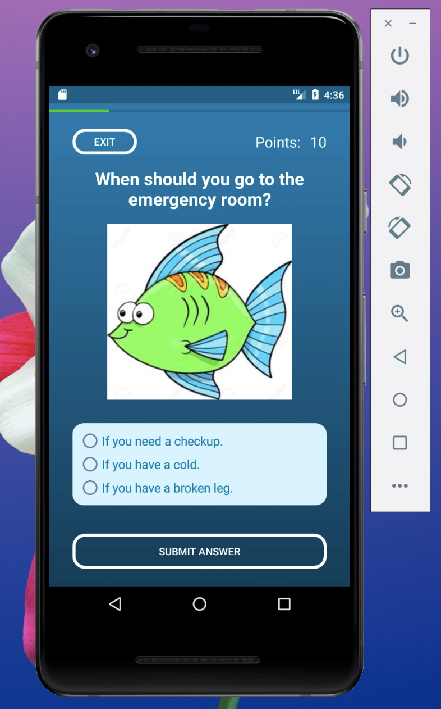
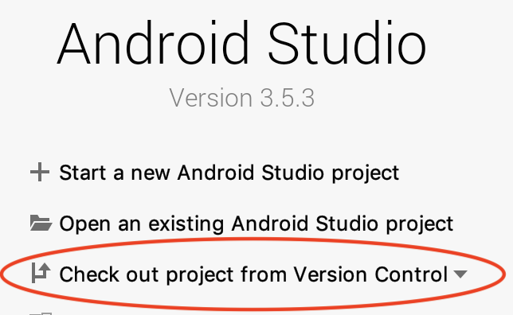

# Health Quiz Android App

This repository is a copy of the private original repository, that was moved here for organizational reasons. This is a group project that was worked on with one other student for a Android Mobile Applications course from Feburary to May 2019. The goal of this project was to compete against other class teams to create a health quiz app for the Florida Literacy Coalition. While our team was not the final one choosen to develop the app we still accomplished creating a stylistic and functional Android app using Android Studio and mySQL to manage a database of FLC provided questions/answers. 

### Getting Started 
To run this project open Android Studio and select "Check out project from Version Control" 

Then paste this repo's URL 

Once the project files have loaded, select the type of Android phone you want to simulate (or plug in one) and click the play button to run the app

### Built With 

* Android Studio - IDE
* mySQL - Database of questions and answers 

### Authors 

* Kyle Dennison - KyleDennison
* Jesus Olive - olivejesus117

